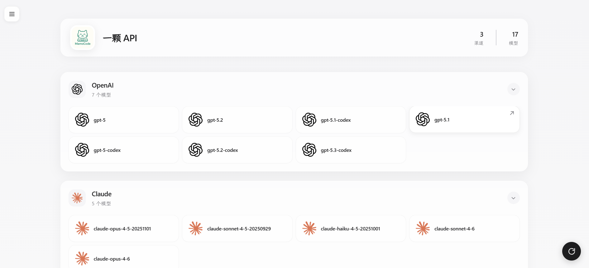

# Model Gallery

将获取到的模型列表按关键词分组展示，专门为 NewAPI 设计，适用于展示 OpenAI 兼容的模型接口。



## 🚀 快速开始

### 本地运行

1. 安装 Deno（参考 [官方文档](https://docs.deno.com/runtime/getting_started/installation/)）
2. 复制配置文件示例并编辑：
   ```bash
   cp config.example.json config.json
   # 编辑 config.json 文件，填入你的配置
   ```
3. 运行项目：
   ```bash
   deno run --allow-all main.ts
   ```
4. 打开浏览器访问 http://localhost:8000

### Deno Deploy 部署

1. 登录 [Deno](https://dash.deno.com) Dashboard
2. 创建一个 New Playground
3. 粘贴 `main.ts` 代码
4. 添加环境变量 `CONFIG_JSON`，值为配置文件的 JSON 内容

## ⚙️ 配置说明

### 配置格式

```json
{
  "sites": [
    {
      "name": "站点名称",
      "apiUrl": "https://api.example.com",
      "apiKey": "sk-xxxxxxxxxxxxxxxxxxxxxxxx",
      "apiEndpoint": "/v1/models",
      "externalUrl": "https://example.com",
      "iconUrl": "https://example.com/icon.png"
    }
  ],
  "defaultSite": "站点名称"
}
```

### 站点配置字段

| **字段名**    | **类型** | **说明**                                                  | **默认值**                                          | **是否必选** |
| ------------- | -------- | --------------------------------------------------------- | --------------------------------------------------- | ------------ |
| `name`        | String   | 站点名称，显示在页面顶部                                  | -                                                   | 必选         |
| `apiUrl`      | URL      | API 基础地址                                              | -                                                   | 必选         |
| `apiKey`      | String   | API 访问密钥                                              | -                                                   | 必选         |
| `apiEndpoint` | String   | API 端点路径                                              | `/v1/models`                                        | 可选         |
| `externalUrl` | URL      | 图标点击后跳转的链接                                      | `https://github.com/ZhuBaiwan-oOZZXX/Model-Gallery` | 可选         |
| `iconUrl`     | URL      | 站点图标                                                  | `https://docs.newapi.pro/assets/logo.png`           | 可选         |
| `defaultSite` | String   | 默认站点名称，未指定或无效时使用 `sites` 数组的第一个站点 | -                                                   | 可选         |

### 环境变量

| **变量名**    | **类型** | **说明**                                            | **是否必选** |
| ------------- | -------- | --------------------------------------------------- | ------------ |
| `CONFIG_JSON` | String   | 完整的配置 JSON 字符串，优先级高于 config.json 文件 | 可选         |

## 🔍 匹配流程

1. **遍历模型**
   程序会遍历从 API 获取到的每一个模型名称

2. **关键词匹配**
   将模型名称转为小写后，与 `GROUP_CONFIG` 中定义的分组按顺序进行关键词匹配

3. **匹配规则**

- 匹配顺序按照代码中的配置顺序，从上往下进行匹配
- 只要模型名称包含某个分组的任何一个关键词，就会被分配到该分组
- 匹配成功后停止，不再继续匹配其他分组

**示例**：

- `gpt-4-turbo` → 匹配 `OpenAI` 组的 `gpt` 关键词
- `claude-3-opus` → 匹配 `Claude` 组的 `claude` 关键词
- `glm-4` → 匹配 `智谱` 组的 `glm` 关键词
- `unknown-model` → 未匹配到任何关键词，进入 `default` 组

> [!TIP]
> 如果您的模型名称比较混乱，建议在 NewAPI 中的重定向功能修改模型名称，使其更符合分组规则，这样可以获得更好的分组效果。

## ➕ 添加分组

- 修改代码中的 `GROUP_CONFIG` 配置，按照格式添加您需要的分组
- 每个分组包含 `icon`（图标 URL）和 `keywords`（多个匹配关键词），key 将作为组名
- `default` 组为默认分组，未匹配到任何关键词的模型将进入该组

## 🙏 感谢

感谢 [Lobe Icons](https://github.com/lobehub/lobe-icons) 项目提供的精美图标。
